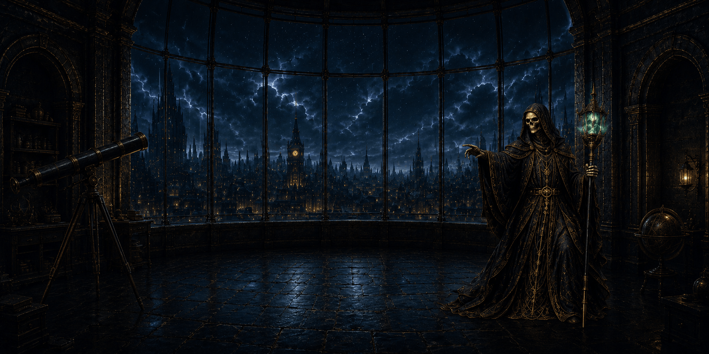

<p align="center">
  
</p>

<p align="center">
  
  
  
  
  
</p>

An atmospheric personal site and portfolio presented as a small internet observatory.

The site is intentionally static, lightweight, and dependency-free. The homepage is a layered observatory scene with separate foreground objects for the desk, telescope, archive cabinet, experiments door, and the standing Keeper. The objects function as spatial navigation on desktop, while the hamburger-triggered terminal menu provides the primary navigation system across all pages.

The site is not a conventional portfolio template. It is intentionally closer to a small interactive art project that happens to contain a portfolio, project records, field notes, experiments, and future activity logs.

[Visit the Observatory →](https://james.bregenzer.dev)

## Current site structure

- `/` — atmospheric observatory homepage.
- `/projects/` — current and completed project records.
- `/experiments/` — prototypes, side projects, and unfinished ideas.
- `/observations/` — notes, signals, and technical observations.
- `/logbook/` — recent work, maintenance notes, and ongoing activity.
- `/archive/` — legacy placeholder retained for now, but no longer included in the primary terminal menu.

The primary terminal menu is ordered as:

1. Projects
2. Experiments
3. Observations
4. Logbook

## Design direction

The visual system is a gothic observatory / terminal interface, not a normal marketing website. The goal is to feel memorable, mysterious, polished, and surprisingly functional.

The shared design language uses:

- near-black surfaces
- observatory green terminal text
- dark gray and charcoal UI accents
- thin borders and small labels
- subtle scanline texture
- restrained atmospheric motion
- monospaced typography
- layered transparent artwork
- dark fantasy / research station cues

This site purposefully avoids generic portfolio cards, bright marketing sections, dashboard UI, unnecessary screenshots, heavy rounded containers, and decorative elements that do not support the observatory metaphor.

The shared color tokens and base typography live near the top of `assets/styles.css`.

## Homepage architecture

The homepage is a single observatory scene.

Core elements:

- `room.webp` — empty architectural room background.
- `workstation.png` — desk/workstation foreground object.
- `telescope.png` — telescope foreground object.
- `archive.png` — archive cabinet foreground object.
- `door.png` — experiments door foreground object.
- `keeper-standing-phase5.webp` — standing Keeper foreground artwork.

The homepage intentionally has no footer navigation. It uses:

- text-only `james.bregenzer.dev` identity in the upper-left corner
- hamburger menu in the upper-right corner
- object-based scene navigation on desktop
- simplified scene behavior at narrower widths

The Keeper is decorative and non-interactive. The telescope, desk, archive cabinet, door, and terminal hotspot are the interactive desktop navigation targets.

## Navigation

Every page loads `assets/navigation.js`.

The script injects a keyboard-accessible hamburger button and a terminal-style menu panel containing:

- Projects
- Experiments
- Observations
- Logbook

Navigation behavior:

- Escape closes the menu.
- Outside click closes the menu.
- Focus is managed while the menu is open.
- Body scrolling is locked while the menu is open.
- The same menu is used on homepage and interior pages.

Do not add duplicate footer navigation or separate page-level nav systems.

## Interior pages

Interior pages share the same general system:

- breadcrumbs
- large uppercase title
- short subtitle
- programmatic `LAST UPDATED` metadata line
- atmospheric artwork
- content-focused body area

The Projects page is the reference implementation. Experiments intentionally mirrors the Projects layout, using the same record-card treatment with separate content and its own atmospheric lab image.

Interior pages should remain readable, useful, atmospheric, and connected to the observatory metaphor.

## Projects and experiments

Project records render from:

- `content/projects/projects.json`
- optional markdown notes in `content/projects/`

Experiment records render from:

- `content/experiments/experiments.json`

The browser-rendered record UI is handled by:

- `assets/projects.js`
- `assets/experiments.js`
- `assets/records.js`

Each record should include:

- `title`
- `slug`
- `status`
- `order`
- `description`
- `tags`
- `url` or `repo`

Projects should read like concise archive records for current and completed work. Experiments should read like active investigations, prototypes, and ideas that may or may not become finished projects.

## Artwork usage

Artwork lives in `assets/img/`.

Guidelines:

- Keep homepage objects as separate transparent foreground assets.
- Keep the room background as architecture only.
- Avoid baking duplicate furniture, doors, cabinets, or interactive objects into the background.
- Use decorative artwork sparingly on interior pages.
- Fade decorative interior artwork into the background instead of presenting it as a hard rectangular image.
- Provide meaningful alt text only when the artwork communicates content.
- Honor `prefers-reduced-motion`.

## Local development

No build step is required.

From the project root, run a static server such as:

```bash
python3 -m http.server 4321
```

Then open:

```text
http://localhost:4321
```

## License

MIT License.
